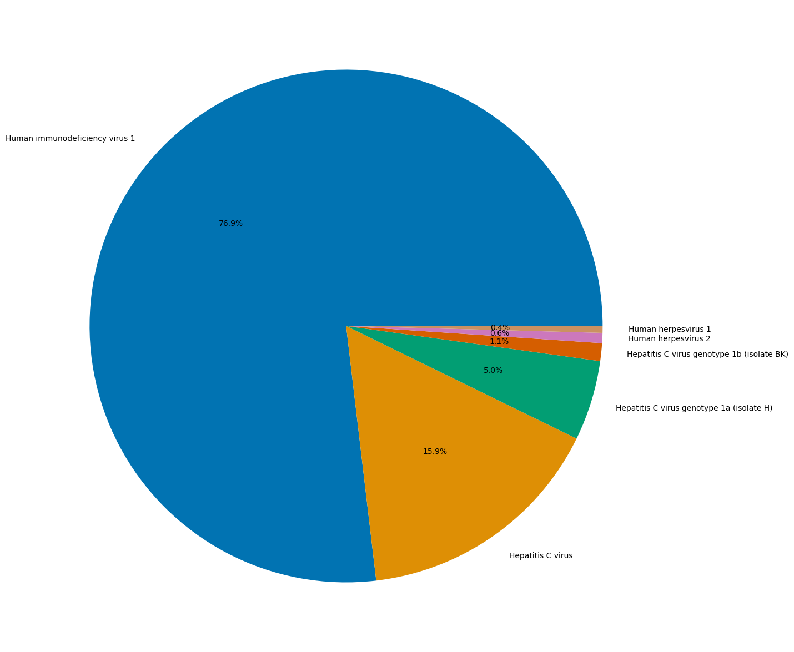
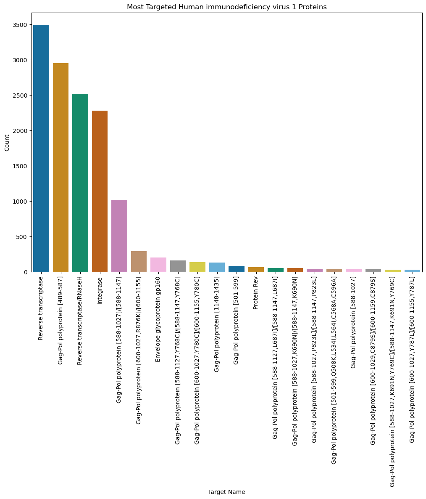
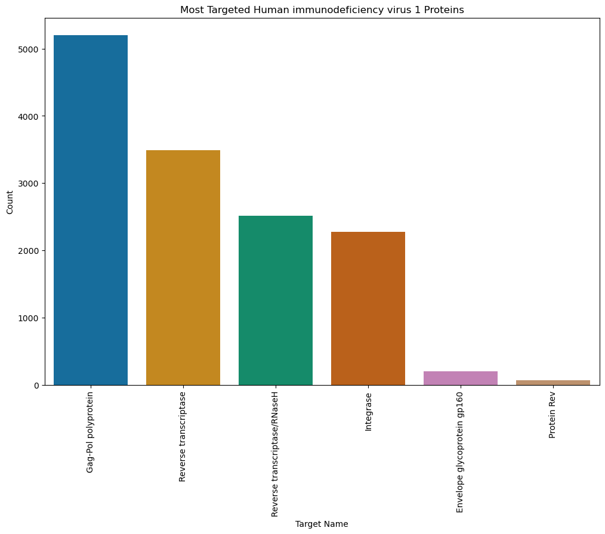
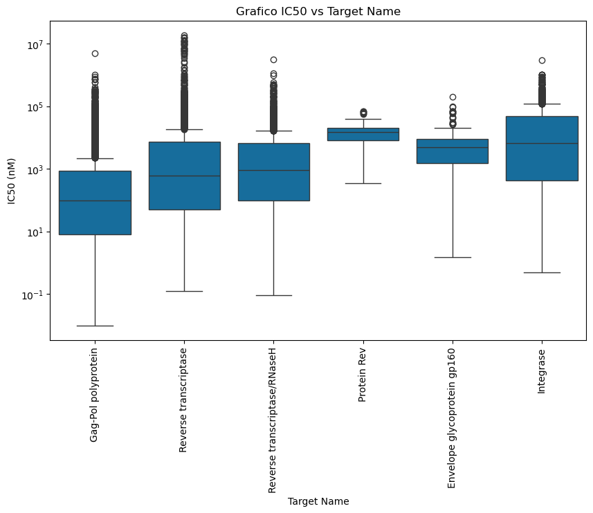

<!-- Sidebar -->
   

    <h3>Project Sections</h3>
    <ul style="list-style-type: none; padding: 0;">
      <li><a href="#introduction">Introduction</a></li>
      <li><a href="#std-and-hiv">STD and HIV</a></li>
      <li><a href="#our-project">Our Project</a></li>
      <li><a href="#dataset">Description of the dataset</a></li>
      <li><a href="#analysis">Analysis</a></li>
    </ul>
  

As social beings, we humans tend to create meaningful romantic relationships. Nevertheless, jumping into this boat implies assuming many risks. Amongst these, infections and viral transmissions like sexually transmitted infections and subsequent diseases (STDs) are one of the most serious ones to such an extent that the World Health Organisation still recognises them as a prominent problem, integrating their potential eradication in its 2030 agenda purposes.
{: .text-justify}

## STD and HIV

The prevalence of STDs has expanded due to factors like increased global travel, changing sexual behaviors, lack of awareness, and insufficient access to healthcare in certain countries. 
The global fight against STDs has been an ongoing battle, with healthcare organizations and governments focusing on prevention, education, and treatment. However, despite considerable progress in some areas, STDs, especially HIV, continue to present challenges
{: .text-justify}

HIV (Human Immunodeficiency Virus type 1) in particular, stands out as one of the most prominent and feared STDs, primarily due to its long-term effects and lack of a cure. It attacks the immune system, specifically targeting CD4 cells (T cells), which are crucial for immune defense. If untreated, HIV leads to acquired immunodeficiency syndrome (AIDS), a condition in which the immune system is severely weakened, making individuals vulnerable to opportunistic infections and certain cancers.
{: .text-justify}
 

HIV-1 is primarily transmitted through unprotected sexual contact, needle sharing, or mother-to-child transfer during childbirth or breastfeeding, as it is present in blood, semen, vaginal fluids, and breast milk.
{: .text-justify}

### Famous people with HIV
Over the years, several prominent individuals have courageously disclosed their HIV status, using their platform to raise awareness, educate the public, and combat the stigma associated with the virus. These figures come from diverse backgrounds. Some of these include:
{: .text-justify}

Magic Johnson – The American basketball legend announced in 1991 that he had tested positive for HIV. His openness helped raise awareness about the disease, and he has lived for decades with the virus, thanks to early diagnosis and treatment.

Freddie Mercury – The iconic lead singer of Queen, Freddie Mercury, died of AIDS-related complications in 1991. His death further fueled global awareness and advocacy for HIV/AIDS research and prevention.

Charlie Sheen – The American actor publicly revealed his HIV-positive status in 2015, sparking discussions about HIV and the importance of safe sex practices and regular testing.

Elizabeth Taylor – The famous actress was an outspoken advocate for HIV/AIDS awareness and co-founded the American Foundation for AIDS Research (amfAR) in 1985 after the death of her friend, Rock Hudson.

### HIV/AIDS STATISTICS AND COST

### Our Project
So, will our contribution be to the HIV struggle?

Fortunately, not only humans live their life in couples but so do chemical compounds, which are created with the only purpose of belonging to their future partner: “their target protein”. With this project we are keen to see how “couples” in the chemical domain strive to combat this aforementioned human problem, contributing to the health of human relationships.
Thus, with our dataset we would like to trace development of the drugs against HIV and try to depict which are the main molecular features that contribute to a higher affinity between drug and HIV target proteins.
We will embark on a quest to uncover patterns among ligands that can more effectively predict affinity, revealing just the tip of the iceberg of the immense potential chemical binding holds for achieving this goal.

### Description of the dataset
To ensure our dataset is suitable for analyzing HIV, we began by narrowing down the BindingDB database to focus exclusively on target organisms related to sexually transmitted diseases (STDs). The resulting subset contains data on proteins and organisms specifically linked to STDs. In the plot below, we visualize the distribution of target source organisms present in our STD dataset. Encouragingly, a significant portion of the targets are proteins from HIV-1, validating the relevance of our dataset for this analysis.

  

### Why choose IC50 as a binding affinity metric?
In the world of drug discovery, four key metrics help us measure the strength and nature of the bond between a drug and its target protein:

-Ki measures the binding affinity of an inhibitor to its target under ideal equilibrium conditions.
-Kd quantifies the strength of the interaction, with lower values indicating tighter binding.
-EC50 gauges the concentration of a drug needed to produce half of its maximal biological effect.
-IC50, our metric of choice, represents the concentration of a drug required to inhibit 50% of the target’s activity in an experimental setup.
While these metrics are interconnected, IC50 stands out for its practical and experimental relevance. Unlike Ki or Kd, which are equilibrium constants requiring specific conditions to interpret accurately, IC50 directly reflects how much of a drug is needed to impede a biological process. Moreover, it is the most frequently reported metric in our dataset, making it both scientifically and statistically robust for our analysis.

  

By focusing on IC50, we ensure that our exploration is grounded in data that is both reliable and meaningful, allowing us to trace patterns in drug-target interactions. This decision shapes our next steps: filtering the dataset to retain only rows with IC50 values, ensuring our analysis is built on a solid foundation.

### What comes next?
With our dataset validated and refined, we are ready to dive deeper into the molecular dynamics of drug-target interactions. By uncovering the features that enhance binding affinity, we aim to contribute to the larger fight against HIV, supporting the development of more effective treatments and, ultimately, healthier human connections.

### Analysis 
To begin, we analyzed the number of unique target proteins present in our target organism (HIV). The visualization below displays all target proteins, including instances where the same protein appears with different mutations or target sites.

  
  
Non-Condensed Target Proteins Distribution

To simplify the analysis, we created a condensed barplot that groups identical proteins together, regardless of mutations or target site variations.

  
  
Condensed Target Proteins Distribution

### Revealing afinities: The first step in our Journey
Our exploration begins with a glimpse into the world of drug-target affinities, focusing on IC50 values for each of the target proteins in our dataset. Through the lens of the representative boxplots below, we uncover the range and variability of these affinities, painting a detailed picture of how well different compounds inhibit their target proteins. Once we complete the analysis, we’ll delve into the patterns and insights these plots reveal—laying the groundwork for our deeper investigation.

  

## References

[^1]: 
[^2]: 
